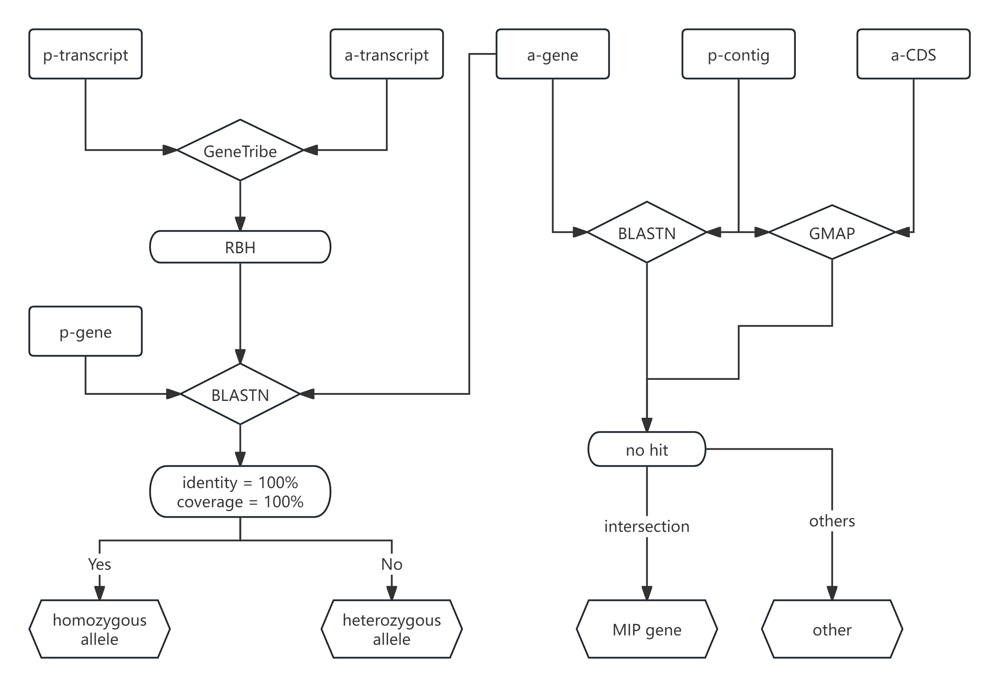

# Gene annotation

- [Gene annotation](#gene-annotation)
  - [1. Structure annotation](#1-structure-annotation)
  - [2. Functional annotation](#2-functional-annotation)
  - [3. The identification of allelic genes](#3-the-identification-of-allelic-genes)
  - [4. The identification of DEA genes](#4-the-identification-of-dea-genes)
  - [5. The identification of RGA](#5-the-identification-of-rga)

## 1. Structure annotation

Three distinct strategies, comprising ab initio, homology-based, and transcriptome-based predictions, were integrated to generate the predicted gene models.

- ab initio prediction

```shell
# Repeat Masking
RepeatMasker -nolow -species rice -pa 64 ${sample}.nucleus.fasta # generate ${sample}.nucleus.masked.fasta

# Gene Prediction using multiple tools
## FgeneSH+
perl run_FgeneSH.pl ${sample}.nucleus.masked.fasta ${sample}.nucleus.masked.fasta.fgenesh seq
perl fgenesh_seq_name.pl ${sample}.nucleus.masked.fasta.fgenesh
perl misc/fgenesh_to_GFF3.pl ${sample}.nucleus.masked.fasta.fgenesh.name >${sample}.nucleus.masked.fasta.fgenesh.name.gff3

## SNAP
snap O.sativa.hmm ${sample}.nucleus.masked.fasta >${sample}.nucleus.masked.fasta.snap.zff.out
perl zff2gff3.pl ${sample}.nucleus.masked.fasta.snap.zff.out >${sample}.nucleus.masked.fasta.snap.zff.gff3
perl SNAP_to_GFF3.pl ${sample}.nucleus.masked.fasta.snap.zff.gff3 >${sample}.nucleus.masked.fasta.snap.forEVM.gff3

## GeneMark-ES
mkdir -p STAR_index
STAR --runMode genomeGenerate --runThreadN ${threads} --genomeDir STAR_index --limitGenomeGenerateRAM 36000000000 --genomeFastaFiles ${sample}.nucleus.masked.fasta
STAR --runThreadN ${threads} --limitBAMsortRAM 8000000000 --genomeDir STAR_index --readFilesIn ${sample}_RNA_clean_1.fastq ${sample}_RNA_clean_2.fastq --outSAMtype BAM SortedByCoordinate --outFilterType BySJout --outFilterMultimapNmax 10 --alignSJoverhangMin 8 --alignSJDBoverhangMin 1 --outFilterMismatchNmax 999 --outFilterMismatchNoverLmax 0.04 --alignIntronMin 20 --alignIntronMax 20000 --alignMatesGapMax 20000 --chimSegmentMin 20
# Convert STAR junctions to GFF format
star_to_gff.pl --star  SJ.out.tab --gff SJ.gff --label STAR
perl gmes_petap.pl --sequence  ${sample}.nucleus.masked.fasta --ET SJ.gff --cores 56
grep -v "intron" genemark.gtf >genemark.mvintron.gtf
perl gtf2gff3.pl --cfg gtf2gff3.cfg genemark.mvintron.gtf >genemark.gff3

## AUGUSTUS
augustus --strand=both --genemodel=partial --gff3=on --species=rice ${sample}.nucleus.masked.fasta >${sample}.nucleus.masked.fasta.out
perl augustus_GFF3_to_EVM_GFF3.pl ${sample}.nucleus.masked.fasta.augustus.out >${sample}.nucleus.masked.fasta.augustus.gff3

cat ${sample}.nucleus.masked.fasta.fgenesh.name.gff3 ${sample}.nucleus.masked.fasta.augustus.gff3 ${sample}.nucleus.masked.fasta.snap.forEVM.gff3 genemark.gff3 >${sample}.nucleus.masked.fasta.gene_prediction.gff3
```

- homology-based prediction

```shell
# GenomeThreader
gth -species rice -gff3out -intermediate -genomic ${sample}.nucleus.masked.fasta -protein ${IRGSP-1.0.protein.fasta} -o ${sample}.nucleus.masked.gth.gff3
grep -v "^#" ${sample}.nucleus.masked.gth.gff3| grep -v "prime_cis_splice_site" | awk -F ";" '{print${sample}}'|sed -E 's/\s+/\t/g' >${sample}.nucleus.masked.gth.edit.gff3
python3 change_name_for_genomethreader.py ${sample}.nucleus.masked.gth.edit.gff3 ${sample}.nucleus.masked.gth.edit.gff3 ${sample}.nucleus.masked.gth.edit.rename.gff3
```

- transcriptome-based predictions

```shell
# Align RNA-seq reads (for different tissues: fringe, leaf, root, seedling) using HISAT2
hisat2-build -p ${threads} ${sample}.nucleus.masked.fasta ${sample}.nucleus.masked.fasta
for tissue in fringe leaf root seedling
do
    hisat2 -p ${threads} --dta --max-intronlen 20000 -x ${sample}.nucleus.masked.fasta -1 ${sample}.${tissue}_RNA_clean_1.fastq -2 ${sample}.${tissue}_RNA_clean_2.fastq -S ${sample}.${tissue}.sam
    samtools sort -@ ${threads} -o ${sample}.${tissue}.bam ${sample}.${tissue}.sam
    stringtie -p ${threads} -o ${sample}.${tissue}.gtf -l ${sample}.${tissue} ${sample}.${tissue}.bam
done

# Merge BAM & GTF Files
samtools merge -@ ${threads} ${sample}.bam ${sample}.fringe.bam ${sample}.leaf.bam ${sample}.root.bam ${sample}.seedling.bam # Merge all BAM files for tissues
samtools sort -@ ${threads} -o ${sample}.sort.bam ${sample}.bam

ls *gtf >mergelist.txt # Merge all GTF files for tissues into a single list
stringtie --merge -p ${threads} -o ${sample}.merge.gtf mergelist.txt

# Trinity assembly (de novo)
Trinity --normalize_reads --seqType fq --SS_lib_type FR --left ${sample}_RNA_clean_1.fastq --right ${sample}_RNA_clean_2.fastq --no_version_check --CPU ${threads} --max_memory 1500G --output trinity >nohup.trinity.out
# Trinity assembly (genome-guided)
Trinity --normalize_reads --seqType fq --SS_lib_type FR --left ${sample}_RNA_clean_1.fastq --right ${sample}_RNA_clean_2.fastq --no_version_check --genome_guided_bam ${sample}.sort.bam --genome_guided_max_intron 25000 --CPU ${threads} --max_memory 1500G --output trinity_ref >nohup.trinity_ref.out &

# PASA
cat ${path}/trinity/Trinity.fasta ${path}/trinity_ref/Trinity-GG.fasta >all_transcripts_normalize.fasta

# Run PASA pipeline to align and assemble transcripts
Launch_PASA_pipeline.pl -c alignAssembly_normalize.config --ALIGNERS gmap -I 25000 --cufflinks_gtf ${sample}.merge.gtf -C -R -g ${sample}.nucleus.masked.fasta -t all_transcripts_normalize.fasta --transcribed_is_aligned_orient --stringent_alignment_overlap 30 --CPU ${threads} >nohup_normalize.out 2>nohup_PASA.out
cat gmap.spliced_alignments.gff3 ${sample}_mydb_pasa_normalize.pasa_assemblies.gff3 ${sample}_mydb_pasa_normalize.valid_gmap_alignments.gff3 >${sample}.nucleus.masked.PASA.assembly.gff3
```

- EVM

```shell
partition_EVM_inputs.pl --genome ${sample}.nucleus.masked.fasta \
    --gene_predictions ${sample}.nucleus.masked.fasta.gene_prediction.gff3 \
    --protein_alignments ${sample}.nucleus.masked.gth.edit.rename.gff3 \
    --transcript_alignments ${sample}.nucleus.masked.PASA.assembly.gff3 \
    --segmentSize 5000000 --overlapSize 100000 --partition_listing partitions_list.out >nohup_partition_EVM_inputs.out

write_EVM_commands.pl --genome ${sample}.nucleus.masked.fasta \
    --gene_predictions ${sample}.nucleus.masked.fasta.gene_prediction.gff3 \
    --protein_alignments ${sample}.nucleus.masked.gth.edit.rename.gff3 \
    --transcript_alignments ${sample}.nucleus.masked.PASA.assembly.gff3 \
    --weights weight.txt --output_file_name evm.out --partitions partitions_list.out >${sample}.EVM.commands.list

awk '{print ${sample},$2,${sample}3"/"$3,$4,${sample}3"/"$5,$6,$7,$8,${sample}3"/"$9,${sample}0,${sample}3"/"${sample}1,${sample}2,${sample}3,${sample}4,${sample}5,${sample}6,${sample}7}' ${sample}.EVM.commands.list >${sample}.EVM.commands.list.addpath
execute_EVM_commands.pl ${sample}.EVM.commands.list.addpath >nohup.execute.commands.out
recombine_EVM_partial_outputs.pl --partitions partitions_list.out --output_file_name ${sample}.evm.out
convert_EVM_outputs_to_GFF3.pl --partitions partitions_list.out --output ${sample}.evm.out --genome ${sample}.nucleus.masked.fasta

# convert GFF3 to protein and CDS fasta
gff3_file_to_proteins.pl ${sample}.evm.out.gff3 ${sample}.nucleus.masked.fasta prot >${sample}.evm.out.aa
gff3_file_to_proteins.pl ${sample}.evm.out.gff3 ${sample}.nucleus.masked.fasta CDS >${sample}.evm.out.cds
```

## 2. Functional annotation

```shell
interproscan.sh -i ${sample}.evm.out.aa -f tsv -dp --goterms --pathways -cpu ${threads}
```

## 3. The identification of allelic genes

This pipeline identifies allelic genes between p-contigs (primary contigs) and a-contigs (alternative contigs) in HiFi genome assemblies. It employs multiple complementary approaches to ensure accurate identification of both homozygous and heterozygous alleles.



Figure 1. Overview of the identification workflow for allelic genes on the a-contigs.

- GeneTribe Analysis

```shell
mkdir -p GeneTribe gene_blast_gene gene_blast_contig cds_gmap_contig
cd GeneTribe
## Prepare bed files and chromosome lists
python -m jcvi.formats.gff bed --key=ID  ${sample}.p-contig.gff3 -o ${sample}.p-contig.bed.tmp && sed 's/evm.TU/evm.model/g' ${sample}.p-contig.bed.tmp >${sample}.p-contig.bed
python -m jcvi.formats.gff bed --key=ID  ${sample}.a-contig.gff3 -o ${sample}.a-contig.bed.tmp && sed 's/evm.TU/evm.model/g' ${sample}.a-contig.bed.tmp >${sample}.a-contig.bed
echo "N" >${sample}.p-contig.chrlist
echo "N" >${sample}.a-contig.chrlist

genetribe core -l  ${sample}.p-contig -f  ${sample}.a-contig -s : -n ${threads} > nohup-genetribe.out
awk '{print $2"\t"${sample}"\t"$2${sample}}' ${path}/*RBH > ${sample}.allele.list
```

- Gene-to-Gene BLAST Analysis

```shell
cd gene_blast_gene
bedtools getfasta -fi ${sample}.p-contig.fasta -bed ../GeneTribe/${sample}.p-contig.bed -fo ${sample}.p-gene.fa_tmp -name && awk -F ':' '{print ${sample}}' ${sample}.p-gene.fa_tmp >${sample}.p-gene.fa
bedtools getfasta -fi ${sample}.a-contig.fasta -bed ../GeneTribe/${sample}.a-contig.bed -fo ${sample}.a-gene.fa_tmp -name && awk -F ':' '{print ${sample}}' ${sample}.a-gene.fa_tmp >${sample}.a-gene.fa
makeblastdb -in ${sample}.p-gene.fa -dbtype nucl -parse_seqids -hash_index -out ${sample}.p-gene
blastn -db ${sample}.p-gene -query ${sample}.a-gene.fa -evalue 1e-5 -outfmt "6 qseqid sseqid pident length mismatch gapopen qstart qend sstart send qlen slen evalue bitscore" -out ${sample}.a-gene_to_p-gene_blast.out -num_threads ${threads} -dust 'no'
```

- Gene-to-Contig BLAST Analysis

```shell
cd gene_blast_contig
makeblastdb -in ${sample}.p-contig.fasta -dbtype nucl -parse_seqids -hash_index -out ${sample}.p-contig
blastn -db ${sample}.p-contig -query ../gene_blast_gene/${sample}.a-gene.fa -evalue 1e-5 -outfmt "6 qseqid sseqid pident length mismatch gapopen qstart qend sstart send qlen slen evalue bitscore" -out ${sample}.a-gene_to_p-contig_blast.out -num_threads ${threads} -dust 'no'
perl get_unmapped_pavs.pl ${sample}.a-gene_to_p-contig_blast.out ../gene_blast_gene/${sample}.a-gene.fa ${sample}.a-contig.unique_gene_blast.list
```

- CDS GMAP to Contig Analysis

```shell
cd cds_gmap_contig
gmap_build -d ${sample}.p-contig ${sample}.p-contig.fasta -D ${path}
gmap -t ${threads} -d ${sample}.p-contig  ${sample}.a-cds.fa -D ${path} -f ${sample} > ${sample}.a-cds_to_p-contig.gmap.sam 2>nohup_gmap.out
grep "No paths found for" nohup_gmap.out |awk '{print $5}' >${sample}.a-contig.unique_gene.gmap.list &
```

- Final Analysis

```shell
# Get unique gene list
cat gene_blast_contig/${sample}.a-contig.unique_gene_blast.list \
    cds_gmap_contig/${sample}.a-contig.unique_gene.gmap.list | \
    sort |uniq -d >${sample}.a-contig.unique_gene.list

# Get homozygous alleles
awk '{print $0"\t"${sample}$2}' gene_blast_gene/${sample}.a-gene_to_p-gene_blast.out >gene_blast_gene/${sample}.a-gene_to_p-gene_blast.txt
awk 'NR==FNR{a[$3]=$3 ;next} NR>FNR{if(${sample}5 in a) print $0}' GeneTribe/${sample}.allele.list gene_blast_gene/${sample}.a-gene_to_p-gene_blast.txt >gene_blast_gene/${sample}.allele_blast.out
awk '{if ($3==100 && $4==${sample}1 && ${sample}2==${sample}1) print $0}' gene_blast_gene/${sample}.allele_blast.out >gene_blast_gene/${sample}.homozygous_allele_blast.out
awk '{print ${sample}"\t"$2"\t"${sample}5}' gene_blast_gene/${sample}.homozygous_allele_blast.out >${sample}.homozygous_allele.list

# Get heterozygous alleles
cat <(awk '{print ${sample}"\t"$2"\t"${sample}5}' \
    gene_blast_gene/${sample}.allele_blast.out |sort |uniq) \
    ${sample}.homozygous_allele.list | \
    sort |uniq -u > ${sample}.hetrozygous_allele.list
```

## 4. The identification of DEA genes

The identification of differential expression allelic genes (DEA) was based on three standards that must be simultaneously satisfied:

- \(\frac{\text{TPM(p-gene)}}{\text{TPM(a-gene)}} > 2\) or \(\frac{\text{TPM(p-gene)}}{\text{TPM(a-gene)}} < \frac{1}{2}\);
- \(\frac{\text{NumReads(p-gene)}}{\text{NumReads(p-gene)} + \text{NumReads(a-gene)}} > 0.75\) or \(\frac{\text{NumReads(p-gene)}}{\text{NumReads(p-gene)} + \text{NumReads(a-gene)}} < 0.25\);
- \(\text{NumReads(p-gene)} + \text{NumReads(a-gene)} \geq 10\);

```shell
# Calculate gene expression levels (TPM) for each tissue using Salmon
cat ${sample}.all-contig.cds ${sample}.all-contig.fasta > ${sample}.all-contig.transcript.fa
grep ">" ${sample}.all-contig.fasta |sed 's/>//g' >${sample}.all-contig_decoys.txt

# Build Salmon index
salmon index -t ${sample}.all-contig_transcript.fa -i ${sample}.all-contig_transcript_index --decoys ${sample}.all-contig_decoys.txt -k 31 -p ${threads}
for tissue in leaf seedling root fringe
do
    salmon quant -i ${sample}.all-contig_transcript_index -l A -1 ${sample}.${tissue}_RNA_clean_1.fastq -2 ${sample}.${tissue}_RNA_clean_2.fastq --validateMappings --gcBias -o ${sample}.all.${tissue}_quant -p ${threads}
done

# Identify DEA genes for each tissue
sh get_ASE.sh ${sample}
```

## 5. The identification of RGA

```shell
# Identify RGAs using RGAugury
RGAugury.pl -p ${sample}.aa -n ${sample}.cds -g ${sample}.genome.fasta -gff ${sample}.genome.gff3 -c ${thread} -pfx ${sample}_protein

# Identify tandem genes for NBS, RLK, RLP and TMCC
awk '{if ($3~/gene/) print $0}' ${sample}.genome.gff3|awk '{print $1"\t"$4"\t"$5"\t"$NF}'|awk -F ";" '{print $1}'|sed 's/ID=evm\.TU\.//g'|sed 's/\./_/g' >${sample}.bed
sed 's/evm\.TU\.//g' ${sample}_protein.NBS.candidates.fas|sed 's/\./_/g' >${sample}_protein.NBS.candidates.simple.fa
formatdb -i ${sample}_protein.NBS.candidates.simple.fa -p
blastall -i ${sample}_protein.NBS.candidates.simple.fa -d ${sample}_protein.NBS.candidates.simple.fa -e 1e-10 -p blastp -a ${thread} -m 8 -o ${sample}_protein.NBS.candidates.simple.self.blastp
python3.8 -m jcvi.compara.catalog tandem ${sample}_protein.NBS.candidates.simple.self.blastp ${sample}_protein.NBS.candidates.simple.fa ${sample}.bed -o ${sample}_protein.NBS.candidates.simple.tandem.list

# Collinearity analysis between the two species
awk '{if (\$3~/gene/) print \$0}' ${sample}.genome.gff3|awk -F \";\" '{print \$1}'|awk '{print \$1\"\t\"\$4\"\t\"\$5\"\t\"\$NF}'|sed 's/ID=evm\.TU\.//g'|sed 's/\\./_/g' >${sample}.bed
sed 's/evm\.TU\.//g' ${sample}.aa|sed 's/\./_/g' >${sample}.pep
python3.8 -m jcvi.compara.catalog ortholog --dbtype=prot ${sample1} ${sample2}
cat ${sample1}_protein.TMCC.candidates.simple.tandem.list ${sample1}_protein.RLP.candidates.simple.tandem.list ${sample1}_protein.RLK.candidates.simple.tandem.list ${sample1}_protein.NBS.candidates.simple.tandem.list|sed 's/,/\t/g' >${sample1}.RGA.class.tandem.list
python3.8 -m jcvi.compara.synteny mcscan ${sample1}.bed ${sample1}.${sample2}.lifted.anchors --mergetandem=${sample1}.RGA.class.tandem.list --iter=1 -o ${sample1}.${sample2}.withtandem.i1.blocks";
python3.8 -m jcvi.formats.base join --compact -o ${sample1}.262sp.withtandem.i1.blocks.join.out ${sample1}.*.withtandem.i1.blocks

# Merge and de-duplicate all collinear blocks
cat */*262sp.withtandem.i1.blocks.join.out.sort.RGA |sort -u >wild_and_33_and_111_and_super_pan_262sp.withtandem.i1.blocks.join.out.sort.RGA
awk -F "." '{print $0,NF}' wild_and_33_and_111_and_super_pan_262sp.withtandem.i1.blocks.join.out.sort.RGA|sort -k263,263n|awk 'NF=262' >wild_and_33_and_111_and_super_pan_262sp.withtandem.i1.blocks.join.out.sort.RGA.sort
sed 's/ /\t/g' wild_and_33_and_111_and_super_pan_262sp.withtandem.i1.blocks.join.out.sort.RGA.sort >wild_and_33_and_111_and_super_pan_262sp.withtandem.i1.blocks.join.out.sort.RGA.sort.tab
```
